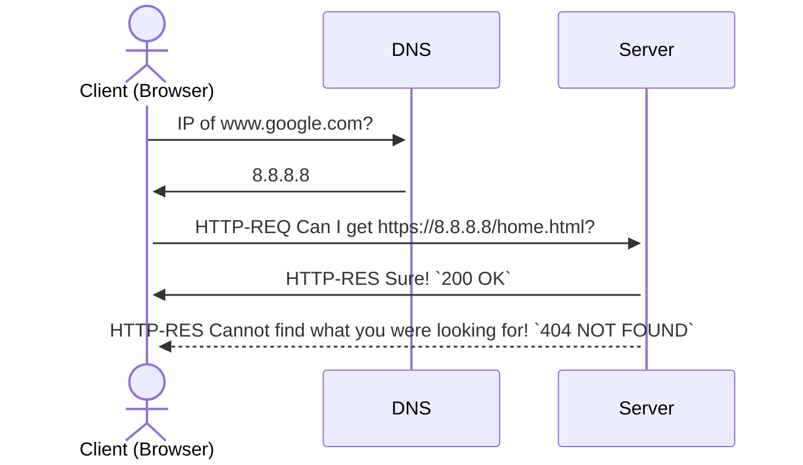

+++

title = "Guide for writing markdown slides"
description = "A Hugo theme for creating Reveal.js presentations"
outputs = ["Reveal"]
aliases = [
    "/guide/"
]

+++

{}
# Introduzione al **Web**
{}

## HTML, CSS, JavaScript

<small>
A cura di Nicholas Magi
</small>

<br>

{}

---
{}

# Il Web

{{% callout type="cite" src="[Enciclopedia Treccani]" srcLink="https://www.treccani.it/enciclopedia/web_%28Enciclopedia-Italiana%29/" %}}
Il **web** (abbreviazione di *world wide web*, 'ragnatela mondiale', spesso indicato brevemente anche come www) è un sistema di **interconnessione tra documenti** basato sull'infrastruttura di Internet che permette l'accesso a tutta l'informazione disponibile su computer collegati in rete.
{}

---

### Sul **web** possono essere disponibili **qualsiasi tipo di documenti**.

Immagini, video, audio, documenti Word, PDF...

---

### Architettura **Client-Server** 


---

### Cosa succede quando si fa una richiesta sul web?



{}

---

## Web standards

- Tecnologie utilizzate per costruire **siti web**.

### Princìpi chiave

1. Libera contribuzione e utilizzo
2. Accessibilità
3. Retrocompatibilità

---

{}


<br>

<small>
<a href="https://www.flaticon.com/free-icons/html" title="html icons">Html icons created by Freepik - Flaticon</a>
</small>


## **HTML**
### **H**yperText **M**arkup **L**anguage

[Guida di riferimento: MDN Docs](https://developer.mozilla.org/en-US/docs/Web/HTML)

---

### Linguaggio di markup
- come $\LaTeX{}$, markdown, XML...
- definisce la *struttura* e il *contenuto* di una pagina

<br>
<br>

{} 
**Non è un linguaggio di programmazione**!
{}

---


---

## HTML: **Tag**

- Una pagina si compone di un insieme di **tag**:
  - ogni tag è composto da un **nome** (*case insensitive*) circondato da `<` e `>`;
  - per ogni tag possono essere specificati alcuni attributi coppia `nome="valore"` che specifica alcune proprietà dell’elemento

---

{}
{}

### Codice sorgente

```html { linenos=inline hl_lines=["4", "15"] }
<!DOCTYPE html> 
<!-- Dichiaro il tipo di documento -->

<html>
  <!-- Parte di metadati della pagina -->
    <head>
      <title>Il mio bellissimo sito</title>
    </head>

    <!-- Contenuto della pagina -->
    <body>
      <p>Lorem Ipsum Ipse Dixit</p>
        <a href="www.google.com">Mi sento fortunato</a>
    </body>
</html>
```
{}
In evidenza il tag `<html>`, **radice** della pagina.
{}

{}
{}

### Render

<iframe height="500"
  sandbox
  srcdoc="<!DOCTYPE html> 
<!-- Dichiaro il tipo di documento -->

<html>
  <!-- Parte di metadati della pagina -->
    <head>
      <title>Il mio bellissimo sito</title>
    </head>

    <!-- Contenuto della pagina -->
    <body>
      <p>Lorem Ipsum Ipse Dixit</p>
        <a href="www.google.com">Mi sento fortunato</a>
    </body>
</html>">
</iframe>
{}

{}

---

## Semantica dei tag


Ogni tag deve essere usato in accordo con il **contenuto che deve rappresentare**.

---

## Tag di sectioning 

{}
{}
```html
<!DOCTYPE html>

<html>
  ...
  <body>
      <header>
          <nav>
              ...
          </nav>
      </header>

      <main>
          <aside>
              ...
          </aside>
          <div>
              <section>
                  ...
              </section>
              <article>
                  ...
              </article>
          </div>
          <aside>
              ...
          </aside>
      </main>
      
      <footer>
          ...
      </footer>
  </body>
</html>
```
{}
{}


{}
Scheletro del codice sorgente e render corrispondente (*decorato con CSS!*)
{}

{}
{}

---

#### Alcuni tag fondamentali
### ``

- ``
  - `src`: percorso dell’immagine (salvata nel filesystem o sul web)
  - `alt`: testo alternativo (mostrato quando l’immagine non viene caricata correttamente)

---

#### Alcuni tag fondamentali
### `<a></a>`

`<a href="www.google.com" target="_blank">Clicca qui</a>`
  - `href`: URL del tag.
  - `target`: specifica dove deve essere aperto quel link — `_blank` indica “in una nuova tab”.

---

## Attributi

- Ce ne sono tanti, alcuni visti poco fa (`href`, `target`, `src`, `alt`...)
- Alcuni sono **universali** — comuni a tutti i tag esistenti:
    - <mark><code>class</code></mark>
    - <mark><code>id</code></mark>
    - `style`
    - `data-`
    - ...

---

## Attributi
<mark><code>class</code> vs <code>id</code></mark>
- **`class`**: identifica un **gruppo di elementi** a cui voglio attribuire caratteristiche comuni.
- **`id`**: identifica un **singolo elemento** della mia pagina.

Entrambi permettono di interagire con il documento HTML tramite **fogli di stile** o **script esterni**.

---

## Attività **#01**


https://it.gravatar.com/

{}

---

{}


## **CSS**
### **C**ascading **S**tyle **S**heet

---

### Cascading Style Sheet
- Tecnologia particolarmente odiata, ma comunque **fondamentale** — è *ovunque*;
- Ha l'importante compito di separare il **contenuto** dalla sua **presentazione**
    - definisce infatti <mark><b>come</b></mark> un contenuto HTML deve essere presentato

<br>
<br>

{} 
**Non è un linguaggio di programmazione**!
{}

---


---

### Importare un foglio di stile
1. foglio di <mark>stile <b>inline</b></mark> 
    - attributo `style` del tag che voglio stilare
2. foglio di <mark>stile <b>interno</b></mark>  
    - importato in `<head>` dal tag `<style>`
3. foglio di <mark>stile <b>esterno</b></mark>  
    1. importato in `<head>` dal tag `<style>`
    2. importato in `<head>` dal tag `<link>`

---

#### 1. CSS inline

```html { linenos=inline hl_lines=["2"] }
...
    <header style="color:blue;">
        <h1>Monsters and Co.</h1>
    </header>
...
```

<br/>
{}
**Pessimo**, mischia il contenuto e la presentazione. 
{}

---

#### 2. CSS in `<head>`
```html { linenos=inline hl_lines=["2-8"] }
...
    <head>
        <style type="text/css">
            header {
                color: blue;
            }
        </style>
    </head>
    <body>
        <header>
            <h1>Monsters and Co.</h1>
        </header>
    </body>
...
```

{}
Iniziamo ad isolare contenuto e presentazione, ma ancora siamo dentro ad HTML.
{}

---

#### 3.1 Foglio esterno

{}
{}
```html { linenos=inline hl_lines=["5-7"]}
<!DOCTYPE html>

<html>
  <head>
      <style type="text/css">
        @import url("styles.css");
      </style>
  </head>
  <body>
    <header>
      <h1>Monsters and Co.</h1>
    </header>
  </body>
</html>
```
`index.html`
{}
{}
```css
header {
  color: blue;
}
```
`styles.css`
{}
{}

{}
Inusuale, ma ci siamo! Esiste tuttavia un'alternativa — più diffusa.
{}

---

#### 3.2 Foglio esterno

{}
{}
```html { linenos=inline hl_lines=["5"]}
<!DOCTYPE html>

<html>
  <head>
    <link rel="stylesheet" href="styles.css">
  </head>
  <body>
    <header>
      <h1>Monsters and Co.</h1>
    </header>
  </body>
</html>
```
`index.html`
{}
{}
```css
header {
  color: blue;
}
```
`styles.css`
{}
{}

{}
Noi facciamo così!
{}

{}